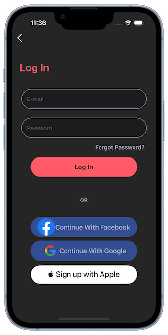
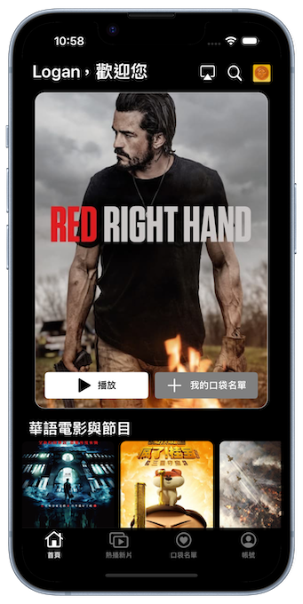

## About
This app is built upon TMDB (The Movie Database) as its foundation, offering users the ability to browse a variety of movie and TV show information. It utilizes Firebase for login authentication, allowing users to register or directly log in with Facebook, Google and Apple. The backend database is powered by Firestore Database, enabling users to save and collect movies they are interested in.

Due to copyright concerns, the app uses YouTube trailers for video content, while the text and image data of the movies are sourced from TMDB. 

The following content includes technical details, feature introductions, and demos of the four main functions.

## Techniques

* Developed using Swift(UIKit) with an MVVM architectural pattern.
* Code auto layout programmatically, without using Storyboard.
* Application of TableView, CustomTableViewCell, CollectionView, and SearchBar
* Protocol-oriented programming
* Closure
* Firebase Authentication
* Testable API class and view model for Unit Test

## Introduction
### Authentication

[Demo video](https://youtu.be/hojQ0-4yL6A)

### Home

[Demo video](https://www.youtube.com/watch?v=4F-UszejoWA)

### HotNewRelease

[Demo video](https://www.youtube.com/watch?v=tuH_Y2zdWZs)

### Search

[Demo video](https://youtu.be/oYRjc9Gm1ug)

## Quick start
1. Due to security concerns, please drag your own GoogleService-Info.plist into the project, which can be downloaded from Firebase console.
2. You can refer to [Add Firebase to your Apple project](https://firebase.google.com/docs/ios/setup#prerequisites) for instructions on setting up Firebase and downloading your own GoogleService-Info.plist.
3. Also, replace your FacebookAppID and FacebookClientToken in Info.plist file for signing in with Facebook.
